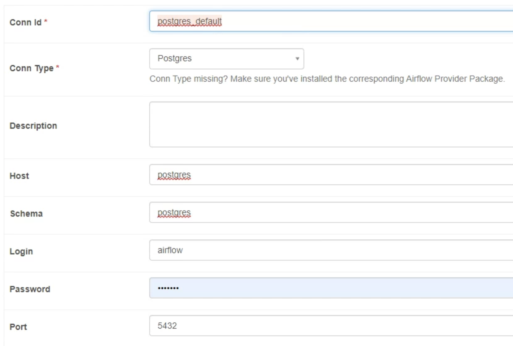

# data-eng-project
5IF INSA - Foundations of data engineering project: Correlation of deaths with power plants (nuclear and thermic) in metropolitan France.

| Student name  | GitHub profile                                    |
| :------------ | ------------------------------------------------- |
| Matthieu ROUX | [M4TTRX](https://github.com/M4TTRX)               |
| Ewen CHAILLAN | [EwenChaillann](https://github.com/EwenChaillann) |

# Project Description

The goal of the project is to create a data pipeline that ingests data of deaths in france along with place of death and locations of active nuclear and thermal power plants  in france and see if there is any correlation between the two. We don't have any pre existing work that proves that there is or isn't a correlation but we thought it would be fun to see. 

## Project report

Project report available [here](docs/Report.md)

Presentation PDF available [here](docs/data%20_eng_presentation.pdf)

## Checklist

- [ ] repository with the code, well documented
- [ ] docker-compose file to run the environment
- [ ] detailed description of the various steps
- [ ] report (Can be in the Repository README) with the project design steps (divided per area)
- [ ] Example dataset: the project testing should work offline, i.e., you need to have some sample data points.
- [x] slides for the project presentation. You can do them too in markdown too.
- [ ] 
## Data Sources:
All the data we will be extracting comes from the french government's data warehouse: [data.gouv.fr](https://www.data.gouv.fr/fr/): 
- [Nuclear reactors adn their location](https://www.data.gouv.fr/fr/datasets/centrales-de-production-nucleaire-dedf-sa/)
- [Thermal power plants](https://www.data.gouv.fr/fr/datasets/centrales-de-production-thermique-a-flamme-dedf-sa-fioul-gaz-charbon/)
- [Deaths and location of french citizens](https://www.data.gouv.fr/fr/datasets/fichier-des-personnes-decedees/)

# Development info
## Getting started

1. Ensure you have Docker installed and running. install all required python packages with `pip install -r requirements.txt`
2. Get your computer's user id by typing in `id -u` in your bash terminal. As a window user you will have to run this command in your WSL terminal as it will not work on CMD or powershell.
3. Create a `.env` file, based on the `.template.env` file. Mae sure to update the `AIRFLOW_UID` in the .env file to the ID you obtained.
4. Build and run the environment using the `docker-compose up` command (run it in the directory of the project). This step will take a while as a lot of images will be downloaded on your computer.
5. If they do not exist yet. Create a folder in your `/dags` folder called **ingestion**. Inside this folder create two sub folders: **staging** and **ingestion**.
6. You can now connect to [localhost:8080](http://localhost:8080/) to access the airflow dashboard, user and password are `airflow`.
7. Now you must add a connection to the postgres SQL database. Navigate To the Admin -> Connections menu, then click the blue + button to add a new connection.
8. Fill in the form like in the image 
## Environment info
| Service  | Address:Port           | Image        |
| :------- | ---------------------- | ------------ |
| postgres | http://localhost:5432/ | postgres:13  |
| airflow  | http://localhost:8080/ |              |
| jupyter  | http://localhost:8888/ |              |
| redis    | http://localhost:6379/ | redis:latest |

